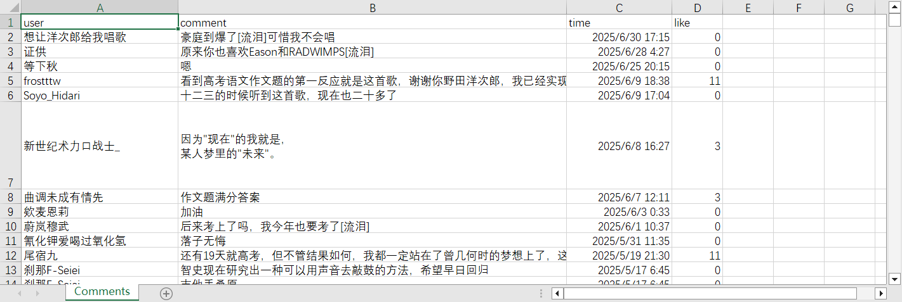

# 基于Spark的网易云音乐评论词云与趋势分析

## 项目简介
本项目用于爬取网易云音乐指定歌曲的评论，进行中文分词、词频统计，并将结果存入MySQL/Hive数据库，最后通过pyecharts生成词云和词频趋势的可视化网页。

## 主要功能
1. **评论爬取**：通过 `main.py` 爬取网易云音乐指定歌曲的评论，保存为 `Comments.csv`。
2. **分词与词频统计**：使用Spark和jieba对评论进行分词，统计词频，结果输出到 `all_words.txt`。
3. **数据入库**：将词频和评论数据分别写入MySQL数据库（`save_to_mysql.py`, `save_to_mysql2.py`），或写入Hive（`save_to_hive.py`）。
4. **可视化**：用 `generate_wordcloud_trend_html.py` 生成词云和高频词趋势的交互式网页（`wordcloud_trend_interactive.html`）。

## 成果展示


## 目录结构
- `main.py`：爬取网易云音乐评论，生成 `Comments.csv`
- `word_count_spark.py`：用Spark和jieba分词，统计词频，生成 `all_words.txt`
- `save_to_mysql.py`：将 `all_words.txt` 词频写入MySQL表 `word_freq`
- `save_to_mysql2.py`：将 `Comments.csv` 评论写入MySQL表 `comments`
- `save_to_hive.py`：将评论分词结果写入Hive表 `wordcloud.comment_words`
- `generate_wordcloud_trend_html.py`：生成词云和趋势可视化网页
- `Comments.csv`：爬取的原始评论数据
- `all_words.txt`：分词统计结果
- `wordcloud_trend_interactive.html`：最终可视化网页

## 依赖环境
- Python 3.8.8
- Spark 3.4
- 主要依赖包：
  - requests
  - pandas
  - jieba
  - pyspark
  - pymysql
  - pyecharts

安装依赖：
```bash
pip install requests pandas jieba pyspark pymysql pyecharts
```

## 数据准备
- 需提前准备好停用词文件（如 `stopwords.txt`），并上传到HDFS指定路径（如 `/user/soukou/stopwords.txt`）。
- 需有可用的MySQL数据库，建库名为 `wordcloud`，并建好 `word_freq` 和 `comments` 两张表。
- Hive需已部署并可用（如需用到Hive）。

## 运行流程
1. **爬取评论**
   ```bash
   python main.py
   ```
   生成 `Comments.csv`。

2. **分词与词频统计**
   ```bash
   spark-submit word_count_spark.py
   ```
   生成 `all_words.txt`。
3. **写入MySQL**
   ```bash
   python save_to_mysql.py
   python save_to_mysql2.py
   ```
4. **（可选）写入Hive**
   ```bash
   spark-submit save_to_hive.py
   ```
5. **生成可视化网页**
   ```bash
   python generate_wordcloud_trend_html.py
   ```
   生成 `wordcloud_trend_interactive.html`，用浏览器打开即可查看。

## 虚拟机环境下的详细操作指南

1. **环境准备**
   - 确保虚拟机已安装 Python 3.8.8、Spark 3.4、Java 8+、pip、MySQL/Hive 客户端。
   - 上传本项目文件夹到虚拟机（可用 scp、WinSCP、Xftp 等工具）。
   - 安装依赖包：
     ```bash
     pip install --user requests pandas jieba pyspark pymysql pyecharts
     ```
2. **准备数据和HDFS**
   - 上传停用词文件到HDFS：
     ```bash
     hdfs dfs -put stopwords.txt /user/soukou/stopwords.txt
     ```
   - 上传评论CSV到HDFS（如需）：
     ```bash
     hdfs dfs -put Comments.csv /user/soukou/Comments.csv
     ```
3. **配置MySQL/Hive**
   - 登录MySQL，创建数据库和表：
     ```sql
     CREATE DATABASE IF NOT EXISTS wordcloud DEFAULT CHARSET utf8mb4;
     USE wordcloud;
     CREATE TABLE IF NOT EXISTS word_freq (
       word VARCHAR(255) PRIMARY KEY,
       freq INT
     );
     CREATE TABLE IF NOT EXISTS comments (
       id INT AUTO_INCREMENT PRIMARY KEY,
       user VARCHAR(255),
       comment TEXT,
       time DATETIME,
       `like` INT
     );
     ```
   - Hive需提前建好 `wordcloud.comment_words` 分区表。
4. **运行各脚本**
   - 爬取评论（如需）：
     ```bash
     python3 main.py
     ```
   - 分词与词频统计：
     ```bash
     spark-submit word_count_spark.py
     ```
   - 写入MySQL：
     ```bash
     python3 save_to_mysql.py
     python3 save_to_mysql2.py
     ```
   - 写入Hive（可选）：
     ```bash
     spark-submit save_to_hive.py
     ```
   - 生成可视化网页：
     ```bash
     python3 generate_wordcloud_trend_html.py
     ```
5. **查看结果**
   - 用 WinSCP/Xftp 等工具将 `wordcloud_trend_interactive.html` 下载到本地，用浏览器打开。

6. **常见问题**
   - 若遇到依赖缺失、端口不通、权限不足等问题，请根据报错信息排查。
   - 数据库连接参数、HDFS 路径等需根据实际环境调整。

## 注意事项
- 需根据实际环境修改脚本中的数据库连接、文件路径等参数。
- 爬虫有频率限制，建议适当延时防止被封IP。
- 若数据量较大，建议在分布式环境下运行Spark相关脚本。

## 致谢
- jieba分词
- pyecharts可视化
- Spark大数据处理 